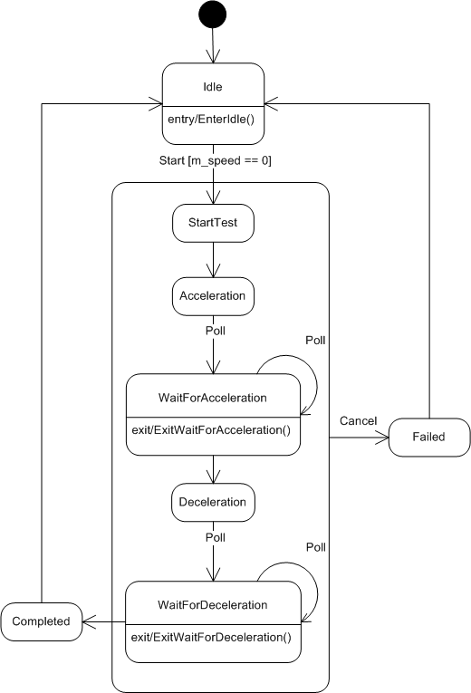
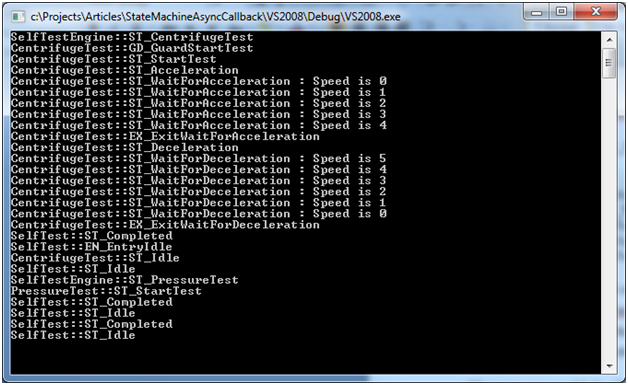

# C++ State Machine with Asynchronous Multicast Delegates
A framework combining C++ state machines with asynchronous multicast delegates.

Originally published on CodeProject at: <a href="https://www.codeproject.com/Articles/1165243/Cplusplus-State-Machine-with-Asynchronous-Multicas">C++ State Machine with Asynchronous Multicast Delegates</a>

## ⚠️ New Repository

See the updated implementation of this code at: <a href="https://github.com/endurodave/StateMachineWithModernDelegates">C++ State Machine with Modern Asynchronous Multicast Delegates</a> 

# Table of Contents

- [C++ State Machine with Asynchronous Multicast Delegates](#c-state-machine-with-asynchronous-multicast-delegates)
  - [⚠️ New Repository](#️-new-repository)
- [Table of Contents](#table-of-contents)
- [Introduction](#introduction)
- [Asynchronous Delegate Callbacks](#asynchronous-delegate-callbacks)
- [Self-Test Subsystem](#self-test-subsystem)
  - [SelfTestEngine](#selftestengine)
  - [CentrifugeTest](#centrifugetest)
  - [Timer](#timer)
- [Win32 and std::thread Worker Threads](#win32-and-stdthread-worker-threads)
- [Heap vs. Pool](#heap-vs-pool)
- [Poll Events](#poll-events)
- [User Interface](#user-interface)
- [Run-Time](#run-time)
- [Conclusion](#conclusion)
- [References](#references)

# Introduction

A software-based Finite State Machines (FSM) is an implementation method used to decompose a design into states and events. Simple embedded devices with no operating system employ single threading such that the state machines run on a single &ldquo;thread&rdquo;. More complex systems use multithreading to divvy up the processing.

Many FSM implementations exist including one I wrote about here on Code Project entitled &ldquo;<a href="http://www.codeproject.com/Articles/1087619/State-Machine-Design-in-Cplusplus"><strong>State Machine Design in C++</strong></a>&rdquo;. The article covers how to create C++ state machines using the <code>StateMachine</code> base class. What is missing, however, is how to integrate multiple state machines into the context of a multithreaded environment.

&ldquo;<a href="https://www.codeproject.com/Articles/1160934/Asynchronous-Multicast-Delegates-in-Cplusplus"><strong>Asynchronous Multicast Delegates in C++</strong></a>&rdquo; is another article I wrote on Code Project. This design provides a C++ delegate library that is capable of synchronous and asynchronous invocations on any callable function.

This article combines the two previously described techniques, state machines and asynchronous multicast delegates, into a single project. In the previous articles, it may not be readily apparent using simple examples how multiple state machines coordinate activities and dispatch events to each other. The goal for the article is to provide a complete working project with threads, timers, events, and state machines all working together. To illustrate the concept, the example project implements a state-based self-test engine utilizing asynchronous communication between threads.

I won&rsquo;t be re-explaining the <code>StateMachine</code> and <code>Delegate&lt;&gt;</code> implementations as the prior articles do that already. The primary focus is on how to combine the state machine and delegates into a single framework.

<a href="https://www.cmake.org/">CMake</a>&nbsp;is used to create the build files. CMake is free and open-source software. Windows, Linux and other toolchains are supported. See the <strong>CMakeLists.txt </strong>file for more information.

Related GitHub repositories:

<ul>
    <li><a href="https://github.com/endurodave/C_StateMachineWithThreads">C Language State Machine with Threads</a> - by David Lafreniere</li>
	<li><a href="https://github.com/endurodave/StateMachineWithModernDelegates">State Machine with Modern Delegates</a> - by David Lafreniere</li>
    <li><a href="https://github.com/endurodave/StateMachine">State Machine Design in C++</a> - by David Lafreniere</li>
</ul>

# Asynchronous Delegate Callbacks

If you&rsquo;re not familiar with a delegate, the concept is quite simple. A delegate can be thought of as a super function pointer. In C++, there&#39;s no pointer type capable of pointing to all the possible function variations: instance member, virtual, const, static, and free (global). A function pointer can&rsquo;t point to instance member functions, and pointers to member functions have all sorts of limitations. However, delegate classes can, in a type-safe way, point to any function provided the function signature matches. In short, a delegate points to any function with a matching signature to support anonymous function invocation.

Asynchronous delegates take the concept a bit further and permits anonymous invocation of any function on a client specified thread of control. The function and all arguments are safely called from a destination thread simplifying inter-thread communication and eliminating cross-threading errors.&nbsp;

The <code>Delegate&lt;&gt;</code> framework is used throughout to provide asynchronous callbacks making&nbsp;an effective publisher and subscriber mechanism. A publisher exposes a delegate container interface and one or more subscribers add delegate instances to the container to receive anonymous callbacks.&nbsp;

The first place it&#39;s used is within the <code>SelfTest</code> class where the <code>SelfTest::CompletedCallback</code>&nbsp;delegate container allows subscribers to add delegates. Whenever a self-test completes a <code>SelfTest::CompletedCallback</code> callback is invoked notifying&nbsp;registered clients. <code>SelfTestEngine</code> registers with both&nbsp;<code>CentrifugeTest</code> and <code>PressureTest</code> to get asynchronously informed when the test is complete.

The second location is the user interface registers&nbsp;with <code>SelfTestEngine::StatusCallback</code>. This allows a client, running on another thread, to register and receive status callbacks during execution. <code>MulticastDelegateSafe1&lt;&gt;</code> allows the client to specify the exact callback thread making is easy to avoid cross-threading errors.

The final location is within the <code>Timer</code> class, which fires periodic callbacks on a registered callback function. A generic, low-speed timer capable of calling a function on the client-specified thread is quite useful for event driven state machines where you might want to poll for some condition to occur. In this case, the <code>Timer</code> class is used to inject poll events into the state machine instances.

# Self-Test Subsystem

Self-tests execute a series of tests on hardware and mechanical systems to ensure correct operation. In this example, there are four state machine classes implementing our self-test subsystem as shown in the inheritance diagram below:

<strong>Figure 1: Self-Test Subsystem Inheritance Diagram</strong>

## SelfTestEngine

<code>SelfTestEngine</code> is thread-safe and the main point of contact for client&rsquo;s utilizing the self-test subsystem. <code>CentrifugeTest </code>and <code>PressureTest </code>are members of SelfTestEngine. <code>SelfTestEngine </code>is responsible for sequencing the individual self-tests in the correct order as shown in the state diagram below. &nbsp;

<strong>Figure 2: SelfTestEngine State Machine</strong>

The <code>Start </code>event initiates the self-test engine.&nbsp;&nbsp;<code>SelfTestEngine::Start()</code> is an asynchronous function that reinvokes the <code>Start()</code> function if the caller is not on the correct execution thread. Perform a simple check whether the caller is executing on the desired thread of control. If not, a temporary asynchronous delegate is created on the stack and then invoked. The delegate and all the caller&rsquo;s original function arguments are duplicated on the heap and the function is reinvoked on <code>m_thread</code>. This is an elegant way to create asynchronous API&rsquo;s with the absolute minimum of effort. Since <code>Start()</code> is asynchronous, &nbsp;it is thread-safe to be called by any client running on any thread.&nbsp;

<pre lang="c++">
void SelfTestEngine::Start(const StartData* data)
{
    // Is the caller executing on m_thread?
    if (m_thread.GetThreadId() != WorkerThread::GetCurrentThreadId())
    {
        // Create an asynchronous delegate and reinvoke the function call on m_thread
        Delegate1&lt;const StartData*&gt;&amp; delegate = MakeDelegate(this, &amp;SelfTestEngine::Start, &amp;m_thread);
        delegate(data);
        return;
    }

    BEGIN_TRANSITION_MAP                                    // - Current State -
        TRANSITION_MAP_ENTRY (ST_START_CENTRIFUGE_TEST)     // ST_IDLE
        TRANSITION_MAP_ENTRY (CANNOT_HAPPEN)                // ST_COMPLETED
        TRANSITION_MAP_ENTRY (CANNOT_HAPPEN)                // ST_FAILED
        TRANSITION_MAP_ENTRY (EVENT_IGNORED)                // ST_START_CENTRIFUGE_TEST
        TRANSITION_MAP_ENTRY (EVENT_IGNORED)                // ST_START_PRESSURE_TEST
    END_TRANSITION_MAP(data)
}</pre>

When each self-test completes, the <code>Complete </code>event fires causing the next self-test to start. After all of the tests are done, the state machine transitions to <code>Completed&nbsp;</code>and back to <code>Idle</code>. If the <code>Cancel </code>event is generated at any time during execution, a transition to the <code>Failed </code>state occurs.

The <code>SelfTest </code>base class provides three states common to all <code>SelfTest</code>-derived state machines: <code>Idle</code>, <code>Completed</code>, and <code>Failed</code>. <code>SelfTestEngine </code>then adds two more states: <code>StartCentrifugeTest </code>and <code>StartPressureTest</code>.

<code>SelfTestEngine </code>has one public event function, <code>Start()</code>, that starts the self-tests. <code>SelfTestEngine::StatusCallback</code> is an asynchronous callback allowing client&rsquo;s to register for status updates during testing. A <code>WorkerThread </code>instance is also contained within the class. All self-test state machine execution occurs on this thread.

<pre lang="c++">
class SelfTestEngine : public SelfTest
{
public:
    // Clients register for asynchronous self-test status callbacks
    static MulticastDelegateSafe1&lt;const SelfTestStatus&amp;&gt; StatusCallback;

    // Singleton instance of SelfTestEngine
    static SelfTestEngine&amp; GetInstance();

    // Start the self-tests. This is a thread-safe asycnhronous function. 
    void Start(const StartData* data);

    WorkerThread&amp; GetThread() { return m_thread; }
    static void InvokeStatusCallback(std::string msg);

private:
    SelfTestEngine();
    void Complete();

    // Sub self-test state machines 
    CentrifugeTest m_centrifugeTest;
    PressureTest m_pressureTest;

    // Worker thread used by all self-tests
    WorkerThread m_thread;

    StartData m_startData;

    // State enumeration order must match the order of state method entries
    // in the state map.
    enum States
    {
        ST_START_CENTRIFUGE_TEST = SelfTest::ST_MAX_STATES,
        ST_START_PRESSURE_TEST,
        ST_MAX_STATES
    };

    // Define the state machine state functions with event data type
    STATE_DECLARE(SelfTestEngine,     StartCentrifugeTest,    StartData)
    STATE_DECLARE(SelfTestEngine,     StartPressureTest,      NoEventData)

    // State map to define state object order. Each state map entry defines a
    // state object.
    BEGIN_STATE_MAP
        STATE_MAP_ENTRY(&amp;Idle)
        STATE_MAP_ENTRY(&amp;Completed)
        STATE_MAP_ENTRY(&amp;Failed)
        STATE_MAP_ENTRY(&amp;StartCentrifugeTest)
        STATE_MAP_ENTRY(&amp;StartPressureTest)
    END_STATE_MAP    
};</pre>

As mentioned previously, the <code>SelfTestEngine </code>registers for asynchronous callbacks from each sub self-tests (i.e. <code>CentrifugeTest </code>and <code>PressureTest</code>) as shown below. When a sub self-test state machine completes, the <code>SelfTestEngine::Complete()</code> function is called. When a sub self-test state machine fails, the <code>SelfTestEngine::Cancel()</code> function is called.

<pre lang="c++">
SelfTestEngine::SelfTestEngine() :
    SelfTest(ST_MAX_STATES),
    m_thread(&quot;SelfTestEngine&quot;)
{
    // Register for callbacks when sub self-test state machines complete or fail
    m_centrifugeTest.CompletedCallback += MakeDelegate(this, &amp;SelfTestEngine::Complete, &amp;m_thread);
    m_centrifugeTest.FailedCallback += MakeDelegate&lt;SelfTest&gt;(this, &amp;SelfTest::Cancel, &amp;m_thread);
    m_pressureTest.CompletedCallback += MakeDelegate(this, &amp;SelfTestEngine::Complete, &amp;m_thread);
    m_pressureTest.FailedCallback += MakeDelegate&lt;SelfTest&gt;(this, &amp;SelfTest::Cancel, &amp;m_thread);
}</pre>

The <code>SelfTest&nbsp;</code>base class generates the <code>CompletedCallback </code>and <code>FailedCallback </code>within the <code>Completed </code>and <code>Failed</code> states respectively as seen below:

<pre lang="c++">
STATE_DEFINE(SelfTest, Completed, NoEventData)
{
    SelfTestEngine::InvokeStatusCallback(&quot;SelfTest::ST_Completed&quot;);

    if (CompletedCallback)
        CompletedCallback();

    InternalEvent(ST_IDLE);
}

STATE_DEFINE(SelfTest, Failed, NoEventData)
{
    SelfTestEngine::InvokeStatusCallback(&quot;SelfTest::ST_Failed&quot;);

    if (FailedCallback)
        FailedCallback();

    InternalEvent(ST_IDLE);
}</pre>

One might ask why the state machines use asynchronous delegate callbacks. If the state machines are on the same thread, why not use a normal, synchronous callback instead? The problem to prevent is a callback into a currently executing state machine, that is, the call stack wrapping back around into the same class instance. For example, the following call sequence should be prevented: <code>SelfTestEngine </code>calls <code>CentrifugeTest </code>calls back <code>SelfTestEngine</code>. An asynchronous callback allows the stack to unwind and prevents this unwanted behavior.

## CentrifugeTest

The <code>CentrifugeTest </code>state machine diagram shown below implements the centrifuge self-test described in &quot;<a href="https://www.codeproject.com/Articles/1087619/State-Machine-Design-in-Cplusplus"><strong>State Machine Design in C++</strong></a>&quot;. <code>CentrifugeTest</code> uses&nbsp;state machine inheritance by inheriting the <code>Idle</code>, <code>Completed</code> and <code>Failed</code> states from the <code>SelfTest</code> class.&nbsp;The difference here is that the <code>Timer</code> class is used to provide <code>Poll </code>events via asynchronous delegate callbacks.

<strong>Figure 3: CentrifugeTest State Machine</strong>

## Timer

The <code>Timer </code>class provides a common mechanism to receive function callbacks by registering with <code>Expired</code>. <code>Start()</code> starts the callbacks at a particular interval. <code>Stop()</code> stops the callbacks.

<pre lang="c++">
class Timer 
{
public:
    static const DWORD MS_PER_TICK;

    /// Client&#39;s register with Expired to get timer callbacks
    SinglecastDelegate0&lt;&gt; Expired;

    /// Constructor
    Timer(void);

    /// Destructor
    ~Timer(void);

    /// Starts a timer for callbacks on the specified timeout interval.
    /// @param[in]    timeout - the timeout in milliseconds.
    void Start(DWORD timeout);

    /// Stops a timer.
    void Stop();
...</pre>

All <code>Timer </code>instances are stored in a private static list. The <code>WorkerThread::Process()</code> loop periodically services all the timers within the list by calling <code>Timer::ProcessTimers()</code>. Client&rsquo;s registered with <code>Expired </code>are invoked whenever the timer expires.

<pre lang="c++">
     case WM_USER_TIMER:
         Timer::ProcessTimers();
         break;</pre>

# Win32 and std::thread Worker Threads

The source code provides two alternative <code>WorkerThread </code>implementations. The Win32 version is contained within <strong>WorkerThreadWin.cpp/h</strong> and relies upon the Windows API. The <code>std::thread</code> version is located at <strong>WorkerThreadStd.cpp/h</strong> and uses the C++11 threading features. One of the two implementations is selected by defining either <code>USE_WIN32_THREADS </code>or <code>USE_STD_THREADS </code>located within <strong>DelegateOpt.h</strong>.

See <a href="http://www.codeproject.com/Articles/1095196/Win-Thread-Wrapper-with-Synchronized-Start"><strong>Win32 Thread Wrapper with Synchronized Start </strong></a>and <a href="http://www.codeproject.com/Articles/1169105/Cplusplus-std-thread-Event-Loop-with-Message-Queue"><strong>C++ std::thread Event Loop with Message Queue&nbsp;and Timer</strong></a> for more information about the underlying thread class implementations.

# Heap vs. Pool

On some projects it is not desirable to utilize the heap to retrieve dynamic storage. Maybe the project is mission critical and the risk of a memory fault due to a fragmented heap in unacceptable. Or maybe heap overhead and nondeterministic execution is considered too great. Either way, the project includes a fixed block memory allocator to divert all memory allocations to a fixed block allocator. Enable the fixed block allocator on the delegate library by defining <code>USE_XALLOCATOR </code>in <strong>DelegateOpt.h</strong>. To enable the allocator on state machines, uncomment <code>XALLOCATOR </code>in <strong>StateMachine.h</strong>.

See <a href="https://www.codeproject.com/Articles/1084801/Replace-malloc-free-with-a-Fast-Fixed-Block-Memory"><strong>Replace malloc/free with a Fast Fixed Block Memory Allocator </strong></a>for more information on <code>xallocator</code>.

# Poll Events

<code>CentrifugeTest </code>has a <code>Timer<strong> </strong></code>instance and registers for callbacks. The callback function, a thread instance and a this pointer is provided to <code>Register()</code> facilitating the asynchronous callback mechanism.

<pre lang="c++">
// Register for timer callbacks
m_pollTimer.Expired = MakeDelegate(this, &amp;CentrifugeTest::Poll, &amp;SelfTestEngine::GetInstance().GetThread());</pre>

When the timer is started using <code>Start()</code>, the <code>Poll()</code> event function is&nbsp;periodically called at the interval specified. Notice that when the <code>Poll()</code> external event function is called, a transition to either WaitForAcceleration or WaitForDeceleration&nbsp;is performed based on the current state of the state machine. If <code>Poll()</code> is called at the wrong time, the event is silently ignored.

<pre lang="c++">
void CentrifugeTest::Poll()
{
&nbsp; &nbsp; BEGIN_TRANSITION_MAP &nbsp; &nbsp; &nbsp; &nbsp; &nbsp; &nbsp; &nbsp; &nbsp; &nbsp; &nbsp; &nbsp; &nbsp; &nbsp; &nbsp; &nbsp; &nbsp; &nbsp; // - Current State -
&nbsp; &nbsp; &nbsp; &nbsp; TRANSITION_MAP_ENTRY (EVENT_IGNORED) &nbsp; &nbsp; &nbsp; &nbsp; &nbsp; &nbsp; &nbsp; // ST_IDLE
&nbsp; &nbsp; &nbsp; &nbsp; TRANSITION_MAP_ENTRY (EVENT_IGNORED) &nbsp; &nbsp; &nbsp; &nbsp; &nbsp; &nbsp; &nbsp; // ST_COMPLETED
&nbsp; &nbsp; &nbsp; &nbsp; TRANSITION_MAP_ENTRY (EVENT_IGNORED) &nbsp; &nbsp; &nbsp; &nbsp; &nbsp; &nbsp; &nbsp; // ST_FAILED
&nbsp; &nbsp; &nbsp; &nbsp; TRANSITION_MAP_ENTRY (EVENT_IGNORED) &nbsp; &nbsp; &nbsp; &nbsp; &nbsp; &nbsp; &nbsp; // ST_START_TEST
&nbsp; &nbsp; &nbsp; &nbsp; TRANSITION_MAP_ENTRY (ST_WAIT_FOR_ACCELERATION) &nbsp; &nbsp;// ST_ACCELERATION
&nbsp; &nbsp; &nbsp; &nbsp; TRANSITION_MAP_ENTRY (ST_WAIT_FOR_ACCELERATION) &nbsp; &nbsp;// ST_WAIT_FOR_ACCELERATION
&nbsp; &nbsp; &nbsp; &nbsp; TRANSITION_MAP_ENTRY (ST_WAIT_FOR_DECELERATION) &nbsp; &nbsp;// ST_DECELERATION
&nbsp; &nbsp; &nbsp; &nbsp; TRANSITION_MAP_ENTRY (ST_WAIT_FOR_DECELERATION) &nbsp; &nbsp;// ST_WAIT_FOR_DECELERATION
&nbsp; &nbsp; END_TRANSITION_MAP(NULL)
}

STATE_DEFINE(CentrifugeTest, Acceleration, NoEventData)
{
&nbsp; &nbsp; SelfTestEngine::InvokeStatusCallback(&quot;CentrifugeTest::ST_Acceleration&quot;);

&nbsp; &nbsp; // Start polling while waiting for centrifuge to ramp up to speed
&nbsp; &nbsp; m_pollTimer.Start(10);
}
</pre>

# User Interface

The project doesn&rsquo;t have a user interface except the text console output. For this example, the &ldquo;user interface&rdquo; just outputs self-test status messages on the user interface thread via the <code>SelfTestEngineStatusCallback()</code> function:

<pre lang="c++">
WorkerThread userInterfaceThread(&quot;UserInterface&quot;);

void SelfTestEngineStatusCallback(const SelfTestStatus&amp; status)
{
    // Output status message to the console &quot;user interface&quot;
    cout &lt;&lt; status.message.c_str() &lt;&lt; endl;
}</pre>

Before the self-test starts, the user interface registers with the <code>SelfTestEngine::StatusCallback</code> callback.

<pre>
SelfTestEngine::StatusCallback += 
&nbsp;     MakeDelegate(&amp;SelfTestEngineStatusCallback, &amp;userInterfaceThread);</pre>

The user interface thread here is just used to simulate callbacks to a GUI library normally running in a separate thread of control.

# Run-Time

The program&rsquo;s <code>main()</code> function is shown below. It creates the two threads, registers for callbacks from <code>SelfTestEngine</code>, then calls <code>Start()</code> to start the self-tests.

<pre lang="c++">
int main(void)
{    
    // Create the worker threads
    userInterfaceThread.CreateThread();
    SelfTestEngine::GetInstance().GetThread().CreateThread();

    // Register for self-test engine callbacks
    SelfTestEngine::StatusCallback += MakeDelegate(&amp;SelfTestEngineStatusCallback, &amp;userInterfaceThread);
    SelfTestEngine::GetInstance().CompletedCallback += 
&nbsp;        MakeDelegate(&amp;SelfTestEngineCompleteCallback, &amp;userInterfaceThread);
    
    // Start the worker threads
    ThreadWin::StartAllThreads();

    // Start self-test engine
    StartData startData;
    startData.shortSelfTest = TRUE;
    SelfTestEngine::GetInstance().Start(&amp;startData);

    // Wait for self-test engine to complete 
    while (!selfTestEngineCompleted)
        Sleep(10);

    // Unregister for self-test engine callbacks
    SelfTestEngine::StatusCallback -= MakeDelegate(&amp;SelfTestEngineStatusCallback, &amp;userInterfaceThread);
    SelfTestEngine::GetInstance().CompletedCallback -= 
&nbsp;        MakeDelegate(&amp;SelfTestEngineCompleteCallback, &amp;userInterfaceThread);

    // Exit the worker threads
    userInterfaceThread.ExitThread();
    SelfTestEngine::GetInstance().GetThread().ExitThread();

    return 0;
}</pre>

<code>SelfTestEngine </code>generates asynchronous callbacks on the <code>UserInteface </code>thread. The <code>SelfTestEngineStatusCallback()</code> callback outputs the message to the console.

<pre lang="c++">
void SelfTestEngineStatusCallback(const SelfTestStatus&amp; status)
{
      // Output status message to the console &quot;user interface&quot;
      cout &lt;&lt; status.message.c_str() &lt;&lt; endl;
}</pre>

The <code>SelfTestEngineCompleteCallback()</code> callback sets a flag to let the <code>main()</code> loop exit.

<pre lang="c++">
void SelfTestEngineCompleteCallback()
{
      selfTestEngineCompleted = TRUE;
}</pre>

Running the project outputs the following console messages:

<strong>Figure 4: Console Output</strong>

# Conclusion

The <code>StateMachine </code>and <code>Delegate&lt;&gt;</code> implementations can be used separately. Each is useful unto itself. However, combining the two offers a novel framework for multithreaded state-driven application development. The article has shown how to coordinate the behavior of state machines when multiple threads are used,&nbsp;which may not be entirely obvious when looking at simplistic, single threaded examples.

I&rsquo;ve successfully used ideas similar to this on many different PC and embedded projects. The code is portable to any platform with a small amount of effort. I particularly like idea of asynchronous delegate callbacks because it effectively hides inter-thread communication and the organization of the state machines makes creating and maintaining self-tests easy.

# References

<ul>
	<li><a href="http://www.codeproject.com/Articles/1087619/State-Machine-Design-in-Cplusplus"><strong>State Machine Design in C++</strong></a> - by David Lafreniere</li>
	<li><a href="https://www.codeproject.com/Articles/1160934/Asynchronous-Multicast-Delegates-in-Cplusplus"><strong>Asynchronous Multicast Delegates in C++</strong></a> - by David Lafreniere</li>
	<li><a href="https://www.codeproject.com/Articles/1156423/Cplusplus-State-Machine-with-Threads"><strong>C++ State Machine with Threads</strong></a> &ndash; by David Lafreniere</li>
	<li><a href="http://www.codeproject.com/Articles/1092727/Asynchronous-Multicast-Callbacks-with-Inter-Thread"><strong>Asynchronous Multicast Callbacks with Inter-Thread Messaging</strong></a> - by David Lafreniere</li>
	<li><strong><a href="http://www.codeproject.com/Articles/1169105/Cplusplus-std-thread-Event-Loop-with-Message-Queue">C++ std::thread Event Loop with Message Queue and Timer</a></strong> - by David Lafreniere</li>
	<li><a href="https://www.codeproject.com/Articles/1095196/Win-Thread-Wrapper-with-Synchronized-Start"><strong>Win32 Thread Wrapper with Synchronized Start </strong></a>- by David Lafreniere</li>
	<li><a href="http://www.codeproject.com/Articles/1084801/Replace-malloc-free-with-a-Fast-Fixed-Block-Memory"><strong>Replace malloc/free with a Fast Fixed Block Memory Allocator </strong></a>- by David Lafreniere</li>
</ul>

